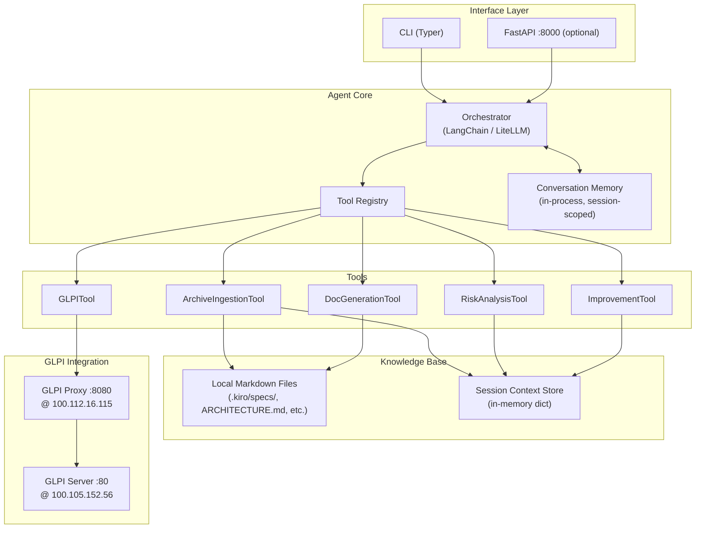
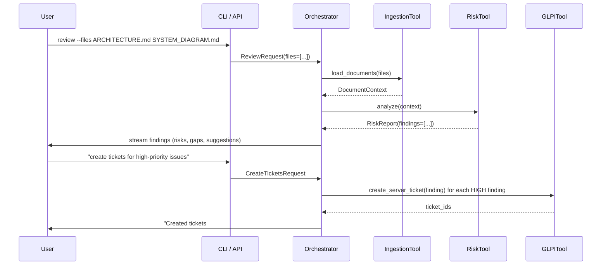
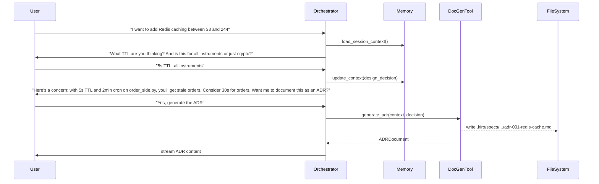

# Design Document: architecture-doc-agent

## Overview

An LLM-backed conversational AI agent that acts as a senior system architect. It ingests architecture documents (Markdown, Mermaid diagrams, spec files) as its knowledge base, reasons about the system to identify risks and improvements, and engages in natural-language design conversations that culminate in formal documentation output (Mermaid diagrams, ADRs, runbooks). It integrates with the existing GLPI Proxy at `100.112.16.115:8080` to create and close tickets for identified issues and completed design tasks.

The agent operates entirely from documents and conversation — it does not SSH into servers, scrape live infrastructure, or poll APIs automatically.

---

## Architecture



---

## Sequence Diagrams

### Architecture Review Flow



### Conversational Design Flow



---

## Components and Interfaces

### Orchestrator

**Purpose**: Central coordinator. Manages the LLM conversation loop, routes user intent to tools, maintains session memory, and streams responses.

**Interface**:
```python
class Orchestrator:
    async def run_review(self, request: ReviewRequest) -> AsyncIterator[str]: ...
    async def run_chat(self, message: str, session_id: str) -> AsyncIterator[str]: ...
    async def run_generate(self, request: GenerateRequest) -> GeneratedDoc: ...
```

**Responsibilities**:
- Detect user intent (review / chat / generate)
- Build LLM prompt with system context + conversation history
- Invoke tools via LangChain tool-calling or direct dispatch
- Stream LLM output back to the interface layer

---

### ArchiveIngestionTool

**Purpose**: Loads local Markdown, Mermaid, and spec files into the session context store. Parses structure (headings, code blocks, tables) to produce a structured `DocumentContext`.

**Interface**:
```python
class ArchiveIngestionTool:
    def load(self, paths: list[Path]) -> DocumentContext: ...
    def load_directory(self, root: Path, glob: str = "**/*.md") -> DocumentContext: ...
```

**Responsibilities**:
- Read and chunk documents
- Extract Mermaid diagrams, tables, and code blocks as typed sections
- Deduplicate overlapping content across files
- Populate `SessionContextStore`

---

### RiskAnalysisTool

**Purpose**: Given a `DocumentContext`, uses the LLM to identify architectural risks across predefined categories.

**Interface**:
```python
class RiskAnalysisTool:
    async def analyze(self, context: DocumentContext) -> RiskReport: ...
```

**Risk categories**: SPOF, security gaps, missing redundancy, tech debt, undocumented components, cross-server coupling, data loss exposure.

---

### ImprovementTool

**Purpose**: Generates concrete improvement proposals with rationale, framed as ADR-style decision records.

**Interface**:
```python
class ImprovementTool:
    async def suggest(self, context: DocumentContext, focus: str | None = None) -> list[Improvement]: ...
```

---

### DocGenerationTool

**Purpose**: Produces formal documentation artifacts from conversation context and explicit requests.

**Interface**:
```python
class DocGenerationTool:
    async def generate_diagram(self, context: DocumentContext, diagram_type: DiagramType) -> str: ...
    async def generate_adr(self, decision: DesignDecision) -> ADRDocument: ...
    async def generate_runbook(self, context: DocumentContext, scenario: str) -> RunbookDocument: ...
    async def generate_arch_doc(self, context: DocumentContext) -> ArchDocument: ...
    def write(self, doc: BaseDocument, output_path: Path) -> None: ...
```

---

### GLPITool

**Purpose**: Creates and closes GLPI tickets via the existing proxy at `100.112.16.115:8080`. Wraps the OAuth flow and ticket lifecycle. Method names mirror the actual MCP tool signatures exposed by `glpi_proxy.py`.

**Interface**:
```python
class GLPITool:
    async def create_server_ticket(
        self, title: str, description: str, agent: str = "kiro", urgency: int = 3
    ) -> int: ...
    async def complete_server_ticket(
        self, ticket_id: int, solution: str = "Tarea completada por agente."
    ) -> None: ...
    async def list_server_tickets(self) -> list[Ticket]: ...
```

**Urgency scale**: 1=very high, 2=high, 3=medium (default), 4=low, 5=very low — matches `glpi_proxy.py`.

---

### ConversationMemory

**Purpose**: Session-scoped in-memory store for conversation history and accumulated design context.

**Interface**:
```python
class ConversationMemory:
    def add_message(self, role: Literal["user", "assistant"], content: str) -> None: ...
    def get_history(self, max_tokens: int = 4096) -> list[Message]: ...
    def add_context(self, key: str, value: Any) -> None: ...
    def get_context(self) -> dict[str, Any]: ...
    def clear(self) -> None: ...
```

---

## Data Models

### DocumentContext

```python
@dataclass
class DocumentSection:
    heading: str
    content: str
    section_type: Literal["prose", "mermaid", "code", "table"]
    source_file: str

@dataclass
class DocumentContext:
    sections: list[DocumentSection]
    raw_text: str          # full concatenated text for LLM context window
    source_files: list[str]
    loaded_at: datetime
```

### RiskReport

```python
@dataclass
class RiskFinding:
    id: str                # e.g. "RISK-001"
    category: RiskCategory
    severity: Literal["critical", "high", "medium", "low"]
    title: str
    description: str
    affected_components: list[str]
    recommendation: str
    glpi_ticket_id: int | None = None

@dataclass
class RiskReport:
    findings: list[RiskFinding]
    summary: str
    generated_at: datetime
```

### Improvement / ADR

```python
@dataclass
class DesignDecision:
    title: str
    context: str           # why this decision is needed
    decision: str          # what was decided
    rationale: str
    consequences: str
    alternatives_considered: list[str]
    status: Literal["proposed", "accepted", "deprecated", "superseded"]

@dataclass
class ADRDocument(BaseDocument):
    decision: DesignDecision
    adr_number: int
    filename: str          # e.g. "adr-001-redis-cache.md"
```

### GLPI Models

```python
@dataclass
class Ticket:
    id: int
    title: str
    content: str
    status: Literal["new", "processing", "pending", "solved", "closed"]
    urgency: int           # 1=very_high ... 5=very_low (matches proxy scale)
    created_at: datetime
```

Urgency is an integer 1–5 matching the proxy's scale directly. No separate `Priority` enum — keeps the model aligned with `glpi_proxy.py`.

---

## Key Functions with Formal Specifications

### `Orchestrator.run_review()`

```python
async def run_review(self, request: ReviewRequest) -> AsyncIterator[str]
```

**Preconditions:**
- `request.files` is non-empty and all paths exist on disk
- LLM client is initialized and reachable
- At least one file is readable as UTF-8 text

**Postconditions:**
- Yields a non-empty stream of string chunks forming a complete review
- `session_context` is populated with the loaded `DocumentContext`
- If `request.auto_ticket` is True and findings with severity >= HIGH exist, GLPI tickets are created
- No mutations to source files

**Loop Invariants:**
- For each streamed chunk: all previously yielded chunks remain valid UTF-8
- GLPI ticket creation is idempotent per finding ID within a session

---

### `RiskAnalysisTool.analyze()`

```python
async def analyze(self, context: DocumentContext) -> RiskReport
```

**Preconditions:**
- `context.raw_text` is non-empty
- `context.sections` contains at least one section

**Postconditions:**
- Returns a `RiskReport` with zero or more findings
- Each finding has a unique `id` within the report
- Each finding's `severity` is one of the defined literals
- `report.summary` is non-empty

**Loop Invariants:**
- For each finding processed: previously assigned IDs remain unique

---

### `GLPITool.create_server_ticket()`

```python
async def create_server_ticket(
    self, title: str, description: str, agent: str = "kiro", urgency: int = 3
) -> int
```

**Preconditions:**
- `title` is non-empty string, len <= 255
- `description` is non-empty string
- `urgency` is an integer in range [1, 5]
- OAuth token is valid or can be refreshed via proxy at `100.112.16.115:8080`
- GLPI proxy is reachable

**Postconditions:**
- Returns a positive integer ticket ID
- Ticket exists in GLPI with status "new"
- If proxy is unreachable: raises `GLPIUnavailableError` (does not silently fail)

---

### `DocGenerationTool.generate_adr()`

```python
async def generate_adr(self, decision: DesignDecision) -> ADRDocument
```

**Preconditions:**
- `decision.title`, `decision.context`, `decision.decision`, `decision.rationale` are all non-empty
- LLM client is reachable

**Postconditions:**
- Returns an `ADRDocument` with `adr_number` assigned sequentially
- `doc.filename` follows pattern `adr-{NNN}-{slug}.md`
- Document content is valid Markdown
- Does not write to disk (caller invokes `write()` separately)

---

## Algorithmic Pseudocode

### Main Review Algorithm

```pascal
ALGORITHM run_review(request)
INPUT: request of type ReviewRequest
OUTPUT: async stream of string chunks

BEGIN
  ASSERT request.files is non-empty
  ASSERT all files in request.files exist

  // Phase 1: Ingest documents
  context ← ArchiveIngestionTool.load(request.files)
  session.store("document_context", context)

  // Phase 2: Build LLM prompt
  system_prompt ← build_review_system_prompt(ARCHITECT_PERSONA)
  user_prompt ← build_review_user_prompt(context.raw_text)
  messages ← [system_prompt, user_prompt]

  // Phase 3: Stream LLM analysis
  full_response ← ""
  FOR each chunk IN llm.stream(messages) DO
    ASSERT chunk is valid UTF-8
    full_response ← full_response + chunk
    YIELD chunk
  END FOR

  // Phase 4: Parse findings from response
  findings ← parse_risk_findings(full_response)
  report ← RiskReport(findings, summary=summarize(findings))

  // Phase 5: Auto-ticket if requested
  IF request.auto_ticket THEN
    FOR each finding IN findings WHERE finding.severity IN [critical, high] DO
      ticket_id ← GLPITool.create_server_ticket(
        title=finding.title,
        description=finding.description + "\n\n" + finding.recommendation,
        agent="kiro",
        urgency=severity_to_urgency(finding.severity)
      )
      finding.glpi_ticket_id ← ticket_id
    END FOR
  END IF

  RETURN report
END
```

### Conversational Chat Algorithm

```pascal
ALGORITHM run_chat(message, session_id)
INPUT: message of type string, session_id of type string
OUTPUT: async stream of string chunks

BEGIN
  ASSERT message is non-empty

  // Load session state
  memory ← ConversationMemory.get_or_create(session_id)
  doc_context ← session.get("document_context")  // may be null

  // Build messages for LLM
  system_prompt ← build_chat_system_prompt(ARCHITECT_PERSONA, doc_context)
  history ← memory.get_history(max_tokens=4096)
  messages ← [system_prompt] + history + [UserMessage(message)]

  // Detect if tool invocation is needed
  intent ← classify_intent(message)

  IF intent = GENERATE_DOC THEN
    doc ← DocGenerationTool.generate(intent.doc_type, doc_context)
    memory.add_message("assistant", doc.content)
    YIELD doc.content
    RETURN
  END IF

  IF intent = CREATE_TICKET THEN
    ticket_id ← GLPITool.create_server_ticket(intent.title, intent.description, agent="kiro", urgency=intent.urgency)
    response ← "Created GLPI ticket #" + ticket_id
    memory.add_message("assistant", response)
    YIELD response
    RETURN
  END IF

  // Default: stream LLM response
  response ← ""
  FOR each chunk IN llm.stream(messages) DO
    response ← response + chunk
    YIELD chunk
  END FOR

  memory.add_message("user", message)
  memory.add_message("assistant", response)
END
```

### Document Ingestion Algorithm

```pascal
ALGORITHM load_documents(paths)
INPUT: paths of type list[Path]
OUTPUT: context of type DocumentContext

BEGIN
  ASSERT paths is non-empty

  all_sections ← []
  raw_parts ← []

  FOR each path IN paths DO
    ASSERT path exists AND path is readable
    text ← read_file(path)
    sections ← parse_markdown_sections(text, source=path.name)

    FOR each section IN sections DO
      ASSERT section.content is non-empty
      all_sections.append(section)
    END FOR

    raw_parts.append("## Source: " + path.name + "\n\n" + text)
  END FOR

  raw_text ← join(raw_parts, separator="\n\n---\n\n")

  ASSERT all_sections is non-empty
  ASSERT raw_text is non-empty

  RETURN DocumentContext(
    sections=all_sections,
    raw_text=raw_text,
    source_files=[p.name for p in paths],
    loaded_at=now()
  )
END
```

---

## Example Usage

### CLI — Architecture Review

```bash
# Review specific files
arch-agent review ARCHITECTURE.md SYSTEM_DIAGRAM.md

# Review with auto-ticket creation for high/critical findings
arch-agent review ARCHITECTURE.md --auto-ticket

# Review all specs in a directory
arch-agent review --dir .kiro/specs/
```

### CLI — Conversational Design

```bash
# Start interactive chat session (loads context from current dir)
arch-agent chat

# Chat with pre-loaded context
arch-agent chat --context ARCHITECTURE.md 100.105.152.56_100.105.152.56/ALGO_TRADING/SPEC.md
```

### CLI — Document Generation

```bash
# Generate an ADR from conversation
arch-agent generate adr --title "Add Redis cache between 33 and 244"

# Generate updated architecture diagram
arch-agent generate diagram --type system-overview --output docs/arch.md

# Generate runbook for a failure scenario
arch-agent generate runbook --scenario "PostgreSQL 244 unreachable"
```

### Python API

```python
from arch_agent import Orchestrator, ReviewRequest

agent = Orchestrator.from_env()

# Review
async for chunk in agent.run_review(ReviewRequest(
    files=["ARCHITECTURE.md", "SYSTEM_DIAGRAM.md"],
    auto_ticket=True
)):
    print(chunk, end="", flush=True)

# Chat
async for chunk in agent.run_chat(
    "What's the blast radius if PostgreSQL on 244 goes down?",
    session_id="session-001"
):
    print(chunk, end="", flush=True)
```

---

## Correctness Properties

*A property is a characteristic or behavior that should hold true across all valid executions of a system — essentially, a formal statement about what the system should do. Properties serve as the bridge between human-readable specifications and machine-verifiable correctness guarantees.*

### Property 1: Document ingestion source file round-trip

*For any* list of valid file paths, loading them via `ArchiveIngestionTool.load()` should produce a `DocumentContext` whose `source_files` contains exactly the basenames of those input paths.

**Validates: Requirements 1.5**

### Property 2: Section type coverage

*For any* Markdown document containing Mermaid blocks, fenced code blocks, tables, and prose, parsing it should produce `DocumentSection` objects whose `section_type` values cover all present content types.

**Validates: Requirements 1.3**

### Property 3: Deduplication invariant

*For any* set of files where some content is duplicated across files, loading them should produce a `DocumentContext` with no duplicate sections.

**Validates: Requirements 1.4**

### Property 4: Ingestion error leaves no partial state

*For any* mix of valid and invalid file paths, if `ArchiveIngestionTool.load()` raises an `IngestionError`, the session context should remain unchanged from its state before the call.

**Validates: Requirements 1.6, 1.7, 9.5**

### Property 5: RiskReport structural invariants

*For any* `RiskReport` returned by `RiskAnalysisTool.analyze()`: all finding IDs are unique within the report, all severities are one of `critical`/`high`/`medium`/`low`, and the summary is non-empty.

**Validates: Requirements 2.3, 2.4, 2.5**

### Property 6: Review stream liveness

*For any* review request where `files` is non-empty and all paths exist, `Orchestrator.run_review()` should yield at least one non-empty string chunk.

**Validates: Requirements 3.1, 3.2**

### Property 7: Auto-ticket count matches high/critical findings

*For any* `RiskReport` with N findings of severity `critical` or `high`, running a review with `auto_ticket=True` should result in exactly N calls to `GLPITool.create_server_ticket`.

**Validates: Requirements 3.3**

### Property 8: Severity-to-urgency mapping

*For any* finding with severity `critical`, the urgency passed to `GLPITool.create_server_ticket` should be 1; for severity `high`, it should be 2.

**Validates: Requirements 3.4**

### Property 9: Review does not mutate source files

*For any* review request, the modification times and contents of all source files should be identical before and after `run_review()` completes.

**Validates: Requirements 3.5**

### Property 10: Conversation history insertion order

*For any* sequence of messages added to `ConversationMemory`, `get_history()` should return them in the same insertion order, and after `clear()` the history should be empty.

**Validates: Requirements 4.5, 5.1, 5.4**

### Property 11: Token budget enforcement

*For any* conversation history whose total token count exceeds `max_tokens`, `get_history(max_tokens=N)` should return only the most recent messages whose total token count fits within N.

**Validates: Requirements 4.6, 5.2**

### Property 12: Context key-value round-trip

*For any* key-value pair added via `ConversationMemory.add_context(key, value)`, calling `get_context()` should return a dict containing that key with the same value.

**Validates: Requirements 5.3**

### Property 13: Session isolation

*For any* two distinct session IDs, adding messages to one session's `ConversationMemory` should not affect the other session's history or context.

**Validates: Requirements 5.5**

### Property 14: ADR filename and content format

*For any* `DesignDecision` with non-empty required fields, `DocGenerationTool.generate_adr()` should return an `ADRDocument` whose `filename` matches `adr-\d{3}-[a-z0-9-]+\.md` and whose content is valid Markdown.

**Validates: Requirements 6.1, 6.3**

### Property 15: ADR sequential numbering

*For any* sequence of N `generate_adr` calls within a session, the returned `adr_number` values should be 1, 2, …, N in order.

**Validates: Requirements 6.2**

### Property 16: generate_adr does not write to disk

*For any* call to `DocGenerationTool.generate_adr()` without a subsequent `write()` call, no new files should appear on disk.

**Validates: Requirements 6.4, 10.5**

### Property 17: write round-trip

*For any* document written via `DocGenerationTool.write(doc, path)`, reading the file at `path` should return content equal to `doc.content`.

**Validates: Requirements 6.5**

### Property 18: GLPI ticket creation round-trip

*For any* valid `create_server_ticket` call that returns a ticket ID, calling `list_server_tickets()` should include a ticket with that ID and status `new`.

**Validates: Requirements 7.1, 7.2**

### Property 19: GLPI ticket completion

*For any* existing ticket ID, calling `complete_server_ticket(ticket_id, solution)` should result in that ticket having status `solved` when subsequently retrieved.

**Validates: Requirements 7.3**

### Property 20: GLPIUnavailableError on unreachable proxy

*For any* GLPITool operation when the proxy at `100.112.16.115:8080` is unreachable, the operation should raise `GLPIUnavailableError` and leave no partial state.

**Validates: Requirements 7.5, 9.1**

### Property 21: OAuth token not written to disk

*For any* GLPITool authentication flow, no token files should be written to disk; tokens should exist only in memory.

**Validates: Requirements 10.2**

### Property 22: Sensitive headers masked in logs

*For any* HTTP request made by the GLPITool, log output should not contain the literal values of `Authorization` or `client_secret` headers.

**Validates: Requirements 10.3**

---

## Error Handling

### GLPI Proxy Unreachable

**Condition**: `100.112.16.115:8080` is not reachable (network partition, service down)
**Response**: Raise `GLPIUnavailableError` with descriptive message; log the failure
**Recovery**: Agent continues operating in degraded mode — review and chat work normally, ticket creation is queued or skipped with user notification

### LLM API Failure

**Condition**: LLM provider returns error or times out
**Response**: Raise `LLMUnavailableError`; surface error message to user via CLI/API
**Recovery**: User can retry; session memory is preserved so context is not lost

### File Not Found / Unreadable

**Condition**: A path passed to ingestion does not exist or is not UTF-8 readable
**Response**: Raise `IngestionError(path, reason)` immediately before any LLM call
**Recovery**: User corrects the path; no partial context is stored

### Token Expiry (GLPI OAuth)

**Condition**: Cached GLPI token has expired mid-session
**Response**: `GLPITool` transparently re-authenticates via `POST /api/v2.2/token` before retrying the failed request
**Recovery**: Transparent to the user; at most one retry per request

---

## Testing Strategy

### Unit Testing

Key units to test in isolation (mock LLM and GLPI proxy):
- `ArchiveIngestionTool.load()` — verify section parsing, Mermaid extraction, deduplication
- `ConversationMemory` — insertion order, token-budget truncation, context isolation between sessions
- `GLPITool` — OAuth flow, ticket creation/close, error handling on 4xx/5xx/network failure
- `DocGenerationTool.write()` — correct filename pattern, no disk write without explicit call

### Property-Based Testing

**Library**: `hypothesis`

Properties to test:
- For any list of valid Markdown strings, `parse_markdown_sections` returns sections whose concatenated content equals the input
- For any `RiskReport`, all finding IDs are unique
- For any `DesignDecision` with non-empty required fields, `generate_adr` returns a document with a valid filename pattern

### Integration Testing

- End-to-end review flow against real local Markdown files (no LLM mock, no GLPI)
- GLPI integration test against the actual proxy at `100.112.16.115:8080` (requires `.env` with credentials)
- CLI smoke test: `arch-agent review ARCHITECTURE.md` exits 0 and produces non-empty output

---

## Performance Considerations

- Document ingestion is synchronous and fast (local disk reads); no caching needed for files < 1MB
- LLM calls are the dominant latency source — all LLM interactions use async streaming to avoid blocking
- `ConversationMemory.get_history()` enforces a token budget to prevent context window overflow on long sessions
- GLPI HTTP calls use `httpx.AsyncClient` with a 30s timeout (matching the existing proxy config)
- No background threads or polling loops — the agent is purely request-driven

---

## Security Considerations

- LLM API keys and GLPI credentials are loaded exclusively from environment variables (`.env` via `pydantic-settings`) — never hardcoded
- GLPI OAuth tokens are stored in memory only, never written to disk
- Sensitive headers (`Authorization`, `client_secret`) are masked in any logs the agent produces, consistent with the existing proxy logging behavior
- The agent does not execute shell commands, SSH into servers, or make outbound network calls beyond the configured LLM provider and GLPI proxy
- Input documents are read-only; the agent only writes to explicitly specified output paths

---

## Dependencies

| Package | Purpose |
|---------|---------|
| `typer` | CLI interface |
| `fastapi` + `uvicorn` | Optional HTTP API interface |
| `langchain` / `litellm` | LLM orchestration and tool-calling |
| `httpx` | Async HTTP client for GLPI proxy |
| `pydantic` + `pydantic-settings` | Data models and config from `.env` |
| `python-dotenv` | `.env` loading |
| `hypothesis` | Property-based testing |
| `pytest` + `pytest-asyncio` | Test runner |

**External services:**
- LLM provider (OpenAI / Anthropic / local Ollama) — configured via `LLM_PROVIDER` env var
- GLPI Proxy at `100.112.16.115:8080` — existing service, no changes required
