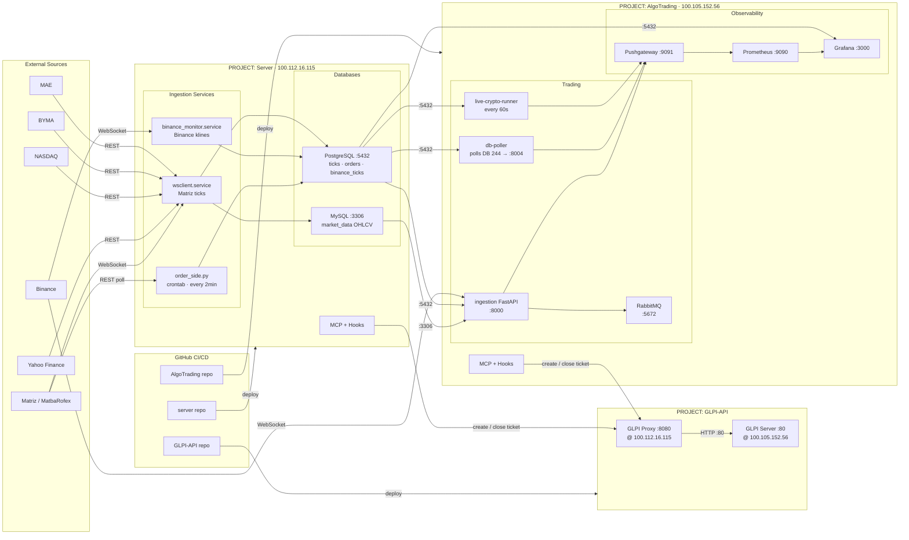
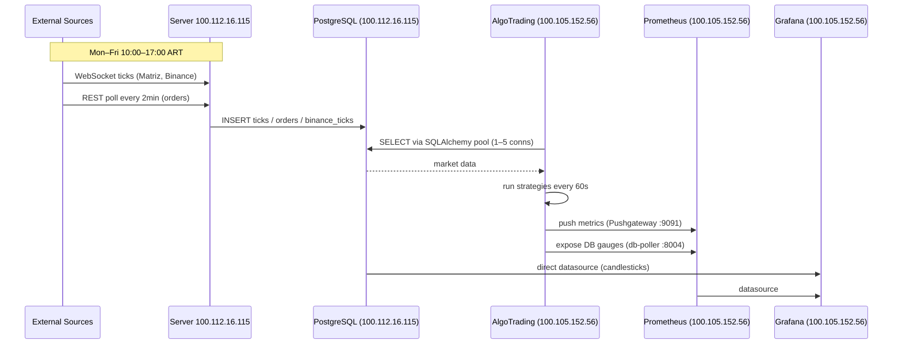
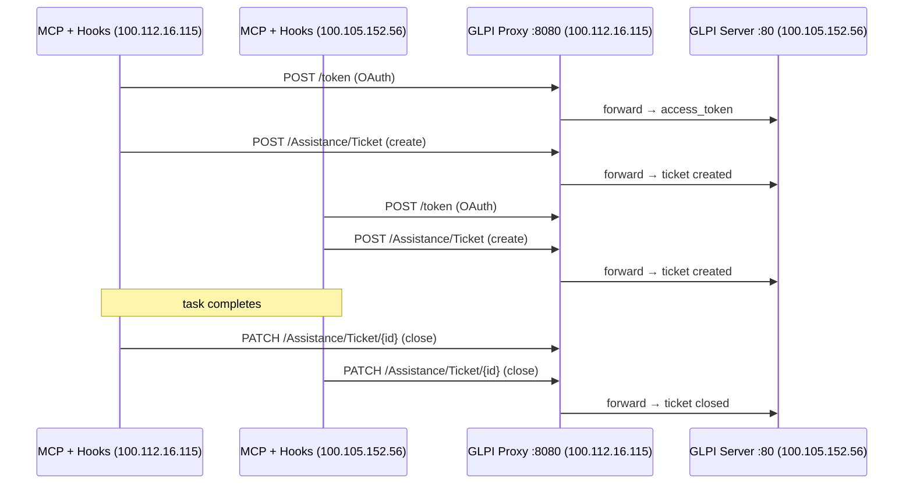

# Arquitectura del Sistema — Homelab
> Última actualización: 2026-03-23

---

## Servidores

| Servidor | IP Local | IP Tailscale | Rol |
|----------|----------|--------------|-----|
| **244** | `192.168.1.244` | `100.112.16.115` | Ingesta de datos + GLPI Proxy |
| **33** | `192.168.1.33` | `100.105.152.56` | AlgoTrading + GLPI Server |

---

## Diagrama General

---

## Flujo de Datos

---

## Flujo GLPI (Tickets)

---

## PROJECT: Server (100.112.16.115)

### Ingestion Services

| Service | Type | Schedule | Output |
|---------|------|----------|--------|
| `wsclient.service` | systemd timer | Mon–Fri 10:00–17:00 ART | `ticks` (Matriz WebSocket) |
| `wsclient-stop.service` | systemd timer | Mon–Fri 17:00 ART | stops wsclient |
| `binance_monitor.service` | systemd timer | Mon–Fri 10:00–17:00 ART | `binance_ticks` |
| `order_side.py` | crontab `*/2` | Mon–Fri 10:00–17:00 ART | `orders` (Matriz REST) |

### Databases

| Engine | DB | Port | Tables |
|--------|----|------|--------|
| PostgreSQL 12 + TimescaleDB | `marketdata` | 5432 | `ticks` ~11.6M · `orders` ~144K · `binance_ticks` ~14K |
| MySQL | `investments` | 3306 | `market_data` (OHLCV yfinance) |

### External Platforms

| Platform | Protocol | Auth |
|----------|----------|------|
| MAE | REST | Public |
| Matriz / MatbaRofex | WebSocket + REST | Cookie via Playwright |
| BYMA | REST POST | Static token |
| NASDAQ | REST | Public |
| Yahoo Finance | yfinance lib | None |
| Binance | WebSocket | API Key + Secret |

---

## PROJECT: GLPI-API

| Component | Host | Port |
|-----------|------|------|
| GLPI Proxy (FastAPI · OAuth · JSONL logs) | `100.112.16.115` | :8080 |
| GLPI Server (IT Asset Management v2.2) | `100.105.152.56` | :80 |

Both servers use MCP + Hooks to automatically open a GLPI ticket before a task starts and close it on completion, via the proxy at `100.112.16.115:8080`.

---

## PROJECT: AlgoTrading (100.105.152.56)

### Trading Services

| Service | Type | Port | Description |
|---------|------|------|-------------|
| `db-poller.service` | systemd | :8004 | polls DB 244 → Prometheus gauges |
| `live-crypto-runner.service` | systemd | — | runs strategies every 60s |
| `algotrading-ingestion` | Docker | :8000/:8001/:8002 | FastAPI ingest + metrics |
| `algotrading-rabbitmq` | Docker | :5672/:15672 | message broker |
| `algotrading-binance-monitor` | Docker | :8003 ⚠️ | Binance live monitor (not scraped) |

### Observability Stack

| Service | Type | Port | Status |
|---------|------|------|--------|
| `algotrading-prometheus` | Docker | :9090 | ✅ |
| `algotrading-grafana` | Docker | :3000 | ✅ |
| `algotrading-pushgateway` | Docker | :9091 | ✅ |
| `algotrading-rabbitmq-exporter` | Docker | :9419 | ✅ |

### Prometheus Scrape Jobs

| Job | Target | Status |
|-----|--------|--------|
| `algotrading-ingestion` | `ingestion:8001` | ✅ |
| `algotrading-backtest` | `ingestion:8002` | ✅ |
| `algotrading-db-poller` | `host.docker.internal:8004` | ✅ |
| `pushgateway` | `pushgateway:9091` | ✅ |
| `rabbitmq` | `rabbitmq-exporter:9419` | ✅ |
| `algotrading-binance` | `binance-monitor:8003` | ❌ down |

### Grafana Dashboards

| Dashboard | Datasource | Shows |
|-----------|-----------|-------|
| Backtest Results | Prometheus | Return · Sharpe · Win rate · live P&L |
| Ingestion | Prometheus | DB 244 row counts · ticks last 5min |
| OHLCV | PostgreSQL direct | Candlestick 1h BTCUSDT + USDTARS |
| RabbitMQ | Prometheus | Queue depth · message rates |

### Active Strategies

| ID | File | Instruments | Logic |
|----|------|-------------|-------|
| BT-10 | `ppi_ohlcv_backtest.py` | 36 PPI tickers | MA / RSI / Bollinger |
| BT-11 | `options_backtest.py` | GGAL options | Black-Scholes long/short |
| BT-12 | `bt12_extended.py` | 36 tickers + BTCUSDT/USDTARS 1h | MACD / Stoch / ATR / Momentum |
| BT-14 | `live_rsi.py` | BTCUSDT live | RSI mean-reversion |

---

## Cross-Server Communication

| Connection | Protocol | Direction | Purpose |
|-----------|----------|-----------|---------|
| 100.105.152.56 → 100.112.16.115:5432 | PostgreSQL TCP | Pull | market data for strategies + Grafana |
| 100.105.152.56 → 100.112.16.115:3306 | MySQL TCP | Pull | OHLCV yfinance |
| 100.112.16.115 → 100.105.152.56:80 | HTTP | Push | GLPI Proxy → GLPI Server |
| 100.112.16.115/100.105.152.56 → 100.112.16.115:8080 | HTTP | Push | MCP+Hooks → GLPI Proxy |

---

## Instrument Naming

| Prefix | Market | Example |
|--------|--------|---------|
| `M:bm_MERV_` | BYMA equities/bonds | `M:bm_MERV_AL30_24hs` |
| `M:rx_DDF_DLR_` | MatbaRofex FX futures | `M:rx_DDF_DLR_MAR26` |
| `BTCUSDT` / `USDTARS` | Binance crypto | — |

> Active futures contract changes monthly — always query dynamically, never hardcode.

---

## Known Issues

| Issue | Impact | Priority |
|-------|--------|----------|
| `algotrading-binance` Prometheus target ❌ down | Low — data from db-poller | Low |
| `finance/PPI/` root has legacy duplicates | Import confusion | Medium |
| `live_rsi.py` duplicates `bt12_extended.py` logic | Tech debt | Medium |
| RabbitMQ consumer in ingestion incomplete (BT-15) | Binance→RMQ→DB flow broken | Medium |
| No backup strategy documented | Data loss risk | High |
| UFW inactive on proxy server | Security risk | High |

---

## Roadmap

| Task | Priority | Effort |
|------|----------|--------|
| Redis cache for market data (TTL 5s) | High | 8h |
| Complete BT-15: RabbitMQ consumer in ingestion | Medium | 4h |
| DB indexes on `(instrument, timestamp)` | Medium | 2h |
| Clean legacy duplicates in `finance/PPI/` | Medium | 2h |
| Unify `live_rsi.py` with `bt12_extended.py` | Medium | 4h |
| Document backup strategy | High | 3h |
| Enable UFW on proxy server | High | 1h |
| Test coverage → 60% | Medium | 12h |
