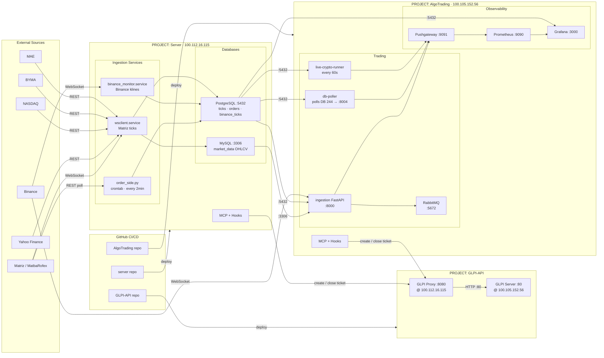

# System Diagram — Homelab
> Last updated: 2026-03-23

```mermaid
graph LR

    subgraph EXT["External Sources"]
        MAE["MAE"]
        MATRIZ["Matriz / MatbaRofex"]
        BYMA["BYMA"]
        BINANCE["Binance"]
        YAHOO["Yahoo Finance"]
        NASDAQ["NASDAQ"]
    end

    subgraph P_SERVER["PROJECT: Server · 100.112.16.115"]
        direction TB

        subgraph SVC244["Ingestion Services"]
            WS["wsclient.service\nMatriz ticks"]
            BM["binance_monitor.service\nBinance klines"]
            OS["order_side.py\ncrontab · every 2min"]
        end

        subgraph DB244["Databases"]
            PG["PostgreSQL :5432\nticks · orders · binance_ticks"]
            MYSQL["MySQL :3306\nmarket_data OHLCV"]
        end

        MCP244["MCP + Hooks"]
    end

    subgraph P_GLPI["PROJECT: GLPI-API"]
        direction TB
        PROXY["GLPI Proxy :8080\n@ 100.112.16.115"]
        GLPI["GLPI Server :80\n@ 100.105.152.56"]
    end

    subgraph P_ALGO["PROJECT: AlgoTrading · 100.105.152.56"]
        direction TB

        subgraph TRADING["Trading"]
            RUNNER["live-crypto-runner\nevery 60s"]
            POLLER["db-poller\npolls DB 244 → :8004"]
            INGEST["ingestion FastAPI\n:8000"]
            RMQ["RabbitMQ\n:5672"]
        end

        subgraph OBS["Observability"]
            PUSH["Pushgateway :9091"]
            PROM["Prometheus :9090"]
            GRAFANA["Grafana :3000"]
        end

        MCP33["MCP + Hooks"]
    end

    subgraph CICD["GitHub CI/CD"]
        GH1["server repo"]
        GH2["AlgoTrading repo"]
        GH3["GLPI-API repo"]
    end

    %% External → Ingestion
    MAE & BYMA & NASDAQ & YAHOO -->|REST| WS
    MATRIZ -->|WebSocket| WS
    MATRIZ -->|REST poll| OS
    BINANCE -->|WebSocket| BM
    BINANCE -->|WebSocket| INGEST

    %% Ingestion → DB
    WS --> PG & MYSQL
    BM & OS --> PG

    %% Cross-server: 244 DB → 33
    PG -->|":5432"| POLLER & RUNNER & INGEST & GRAFANA
    MYSQL -->|":3306"| INGEST

    %% AlgoTrading internal
    INGEST --> RMQ
    RUNNER & POLLER & INGEST --> PUSH
    PUSH --> PROM --> GRAFANA

    %% GLPI ticket flow
    MCP244 & MCP33 -->|"create / close ticket"| PROXY
    PROXY -->|"HTTP :80"| GLPI

    %% CI/CD
    GH1 -->|deploy| P_SERVER
    GH2 -->|deploy| P_ALGO
    GH3 -->|deploy| P_GLPI
```
